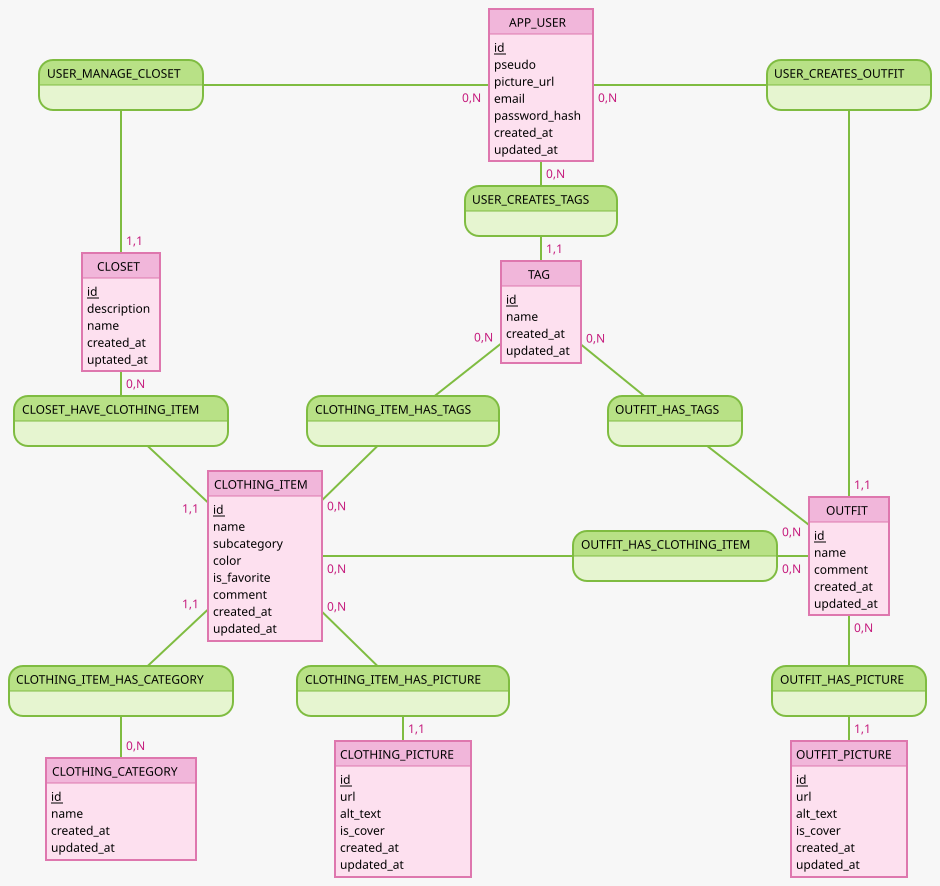

# MCD

Created with [Mocodo](https://www.mocodo.net/)



```txt
USER_MANAGE_CLOSET, 11 CLOSET, 0N APP_USER
:
:
APP_USER: id, pseudo, picture_url, email, password_hash, created_at, updated_at
:
USER_CREATES_OUTFIT, 11 OUTFIT, 0N APP_USER

:
:
:
USER_CREATES_TAGS, 11 TAG, 0N APP_USER
:
:

CLOSET:id, description, name, created_at, updated_at
:
:
TAG:id, name, created_at, updated_at
:
:

CLOSET_HAVE_CLOTHING_ITEM, 11 CLOTHING_ITEM, 0N CLOSET
:
CLOTHING_ITEM_HAS_TAGS, 0N CLOTHING_ITEM, 0N TAG
:
OUTFIT_HAS_TAGS, 0N OUTFIT, 0N TAG
:

:
CLOTHING_ITEM: id, name, subcategory, color, is_favorite, comment, created_at, updated_at
:
:
OUTFIT_HAS_CLOTHING_ITEM, 0N OUTFIT, 0N CLOTHING_ITEM
OUTFIT: id, name, comment, created_at, updated_at

CLOTHING_ITEM_HAS_CATEGORY, 11 CLOTHING_ITEM, 0N CLOTHING_CATEGORY
:
CLOTHING_ITEM_HAS_PICTURE, 0N CLOTHING_ITEM, 11 CLOTHING_PICTURE
:
:
OUTFIT_HAS_PICTURE, 0N OUTFIT, 11 OUTFIT_PICTURE

CLOTHING_CATEGORY: id, name, created_at, updated_at
:
CLOTHING_PICTURE: id, url, alt_text, is_cover, created_at, updated_at
:
:
OUTFIT_PICTURE: id, url, alt_text, is_cover, created_at, updated_at
```
